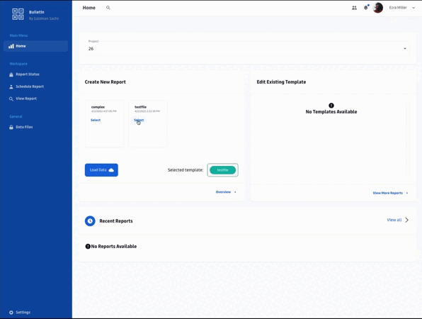
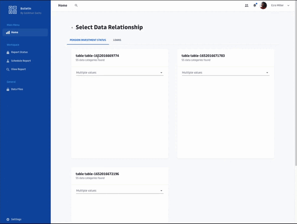

  

  

    This outlines the codebase of our submission for Goldmans Sachs Engineering Engage 2021 Hackathon
  

<!-- TABLE OF CONTENTS -->

  
Table of Contents

  <ol>
    <li>
      <a href="#about-the-project">About The Project</a>
      <ul>
        <li><a href="#customisable-report-rendering">Customisable Report Rendering</a></li>
      </ul>
    </li>
    <li>
      <a href="#built-with">Built With</a>
      <ul>
        <li><a href="#frontend">Frontend</a></li>
        <li><a href="#backend">Backend</a></li>
        <li><a href="#api">API</a></li>
      </ul>
    </li>
    <li>
      <a href="#our-solution">Our Solution</a>
      <ul>
        <li><a href="#architecture">Architecture</a></li>
        <li><a href="#performance">Performance</a></li>
      </ul>
    </li>
    <li><a href="#acknowledgments">Acknowledgments</a></li>
  </ol>

<!-- ABOUT THE PROJECT -->
## About The Project

### Customisable Report Rendering
To design a system that streamlines the report generation process by having a highly customizable, scalable, intuitive and automated report rendering solution.

  

(<a href="#top">back to top</a>)

## Built With

### Frontend
* [Material UI](https://mui.com/)
* [React](https://reactjs.org/)

### Backend
* [Java Spring Boot](https://spring.io/)

### API 
* [ExcelWriter](https://xlsxwriter.readthedocs.io/index.html#)
* [FastAPI](https://fastapi.tiangolo.com/)
* [Pandas](https://pandas.pydata.org/)
* [Python](https://python.org/)

(<a href="#top">back to top</a>)

## Our Solution

> Setting up a project

> File and sheets naming

> Drag and drop capabilities for organising tables on a sheet

> Selecting columns for each respective table 

> Output Excel Report

(<a href="#top">back to top</a>)

### Architecture

  

(<a href="#top">back to top</a>)

  
### Performance 

Measured on a t2-medium AWS EC2 instance (4gb RAM, 30gb Memory)

|   | Small Report (10 Rows x 1 Column) | Medium Report (5 Rows x 5 Columns) | Large Report (10 Rows x 10 Columns) |
| ------------------------ | ------------------------ | ------------------------ | ------------------------ |
| 10 Concurrent Reports | 0.85s | 38.72s | 137s |
| 1000 Concurrent Reports | 14.03s | 173s | 13mins |

* Concurrent load scales well with small-sized, single sheet reports
* Considerable load scalability with medium-sized reports

(<a href="#top">back to top</a>)

<!-- ACKNOWLEDGMENTS -->
## Acknowledgments

* [Ian Chia](https://github.com/theianchia)
* [Joel Lim](https://github.com/joellje)
* [Jonathan Tan](https://github.com/jonathantan1425)
* [Quinn Cheong](https://github.com/quinncheong)

(<a href="#top">back to top</a>)

