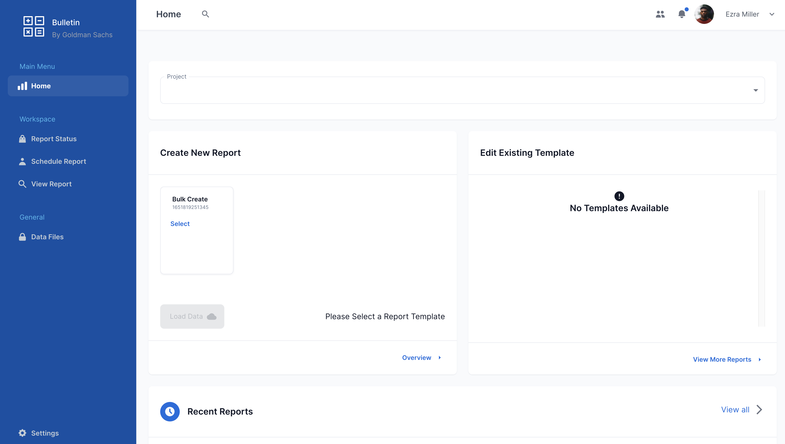

<div align="center">
  
</div>

> Dashboard made with [MUI's](https://mui.com/) components, [React](https://reactjs.org/) and of course [Next.js](https://nextjs.org/)!


## Quick start
1. Make sure your NodeJS and npm versions are up to date for `React 17`
2. Install required dependencies 
  ```sh
	$ npm install or 
    $ yarn 
  ```
3. Start the server
  ```sh
	$ npm run dev or 
    $ yarn dev
  ```
4. Views are on: `localhost:4200`

## File Structure

Within the download you'll find the following directories and files:

```
┌── .eslintrc.json
├── .gitignore
├── CHANGELOG.md
├── jsconfig.json
├── LICENSE.md
├── package.json
├── README.md
├── public
└── src
	├── __mocks__
	├── components
	├── icons
	├── theme
	├── utils
	└── pages
		├── _app.js
		├── _document.js
		├── 404.js
		├── account.js
		├── customers.js
		├── index.js
		├── login.js
		├── products.js
		├── register.js
		└── reports.js
```

